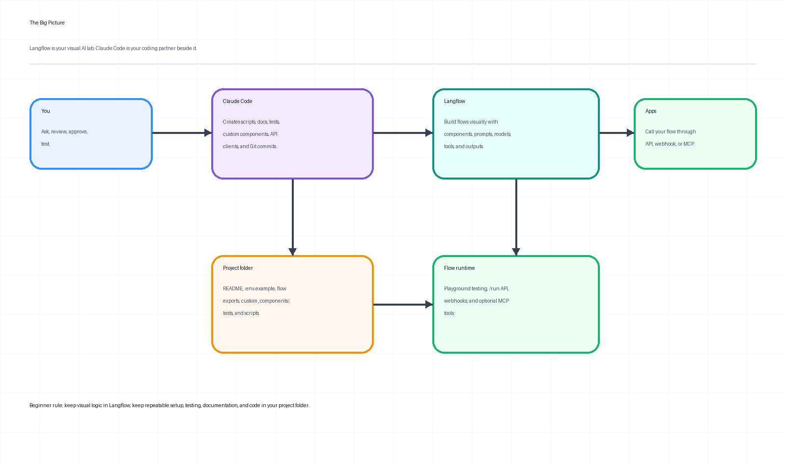
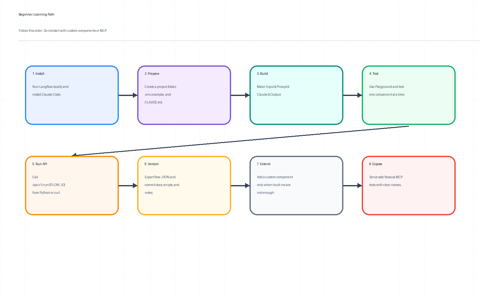
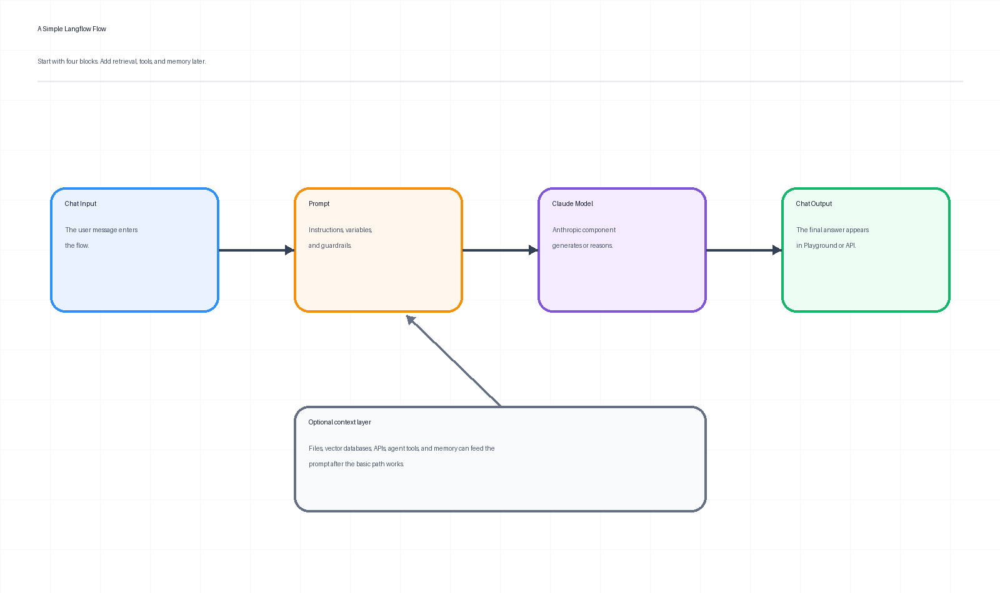
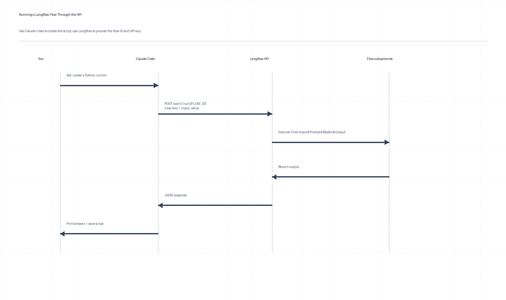
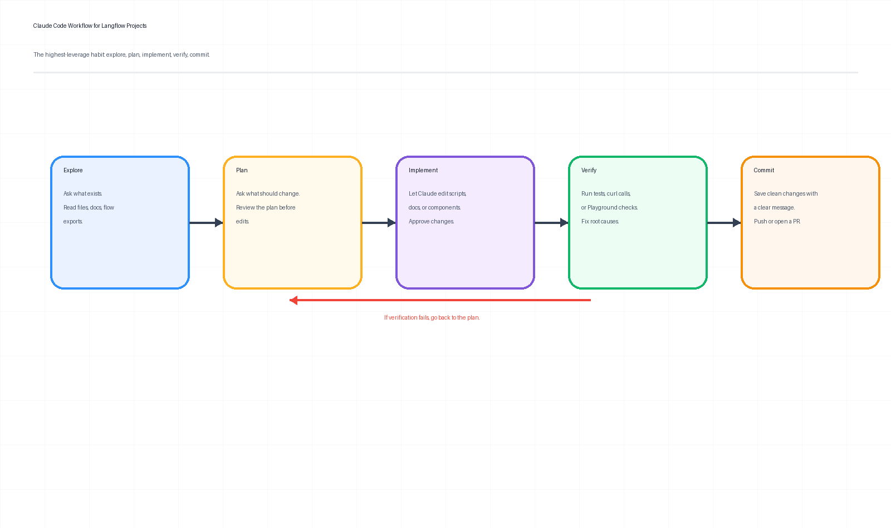
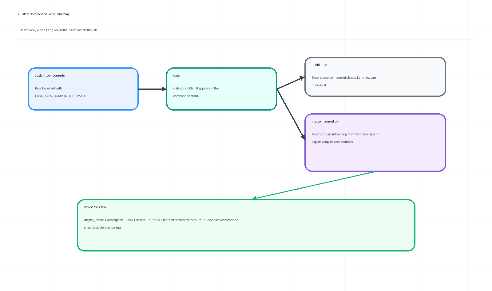
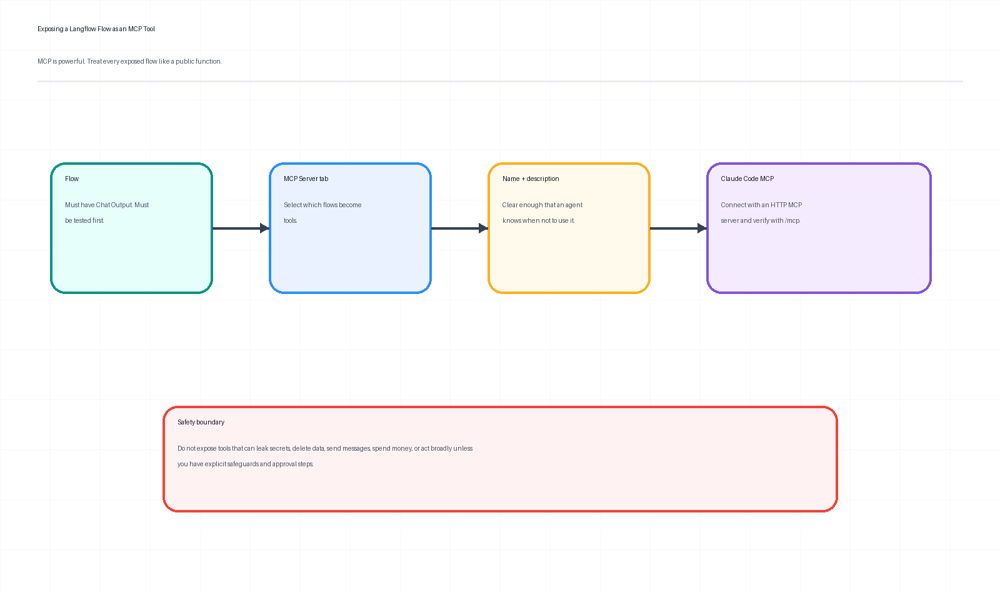
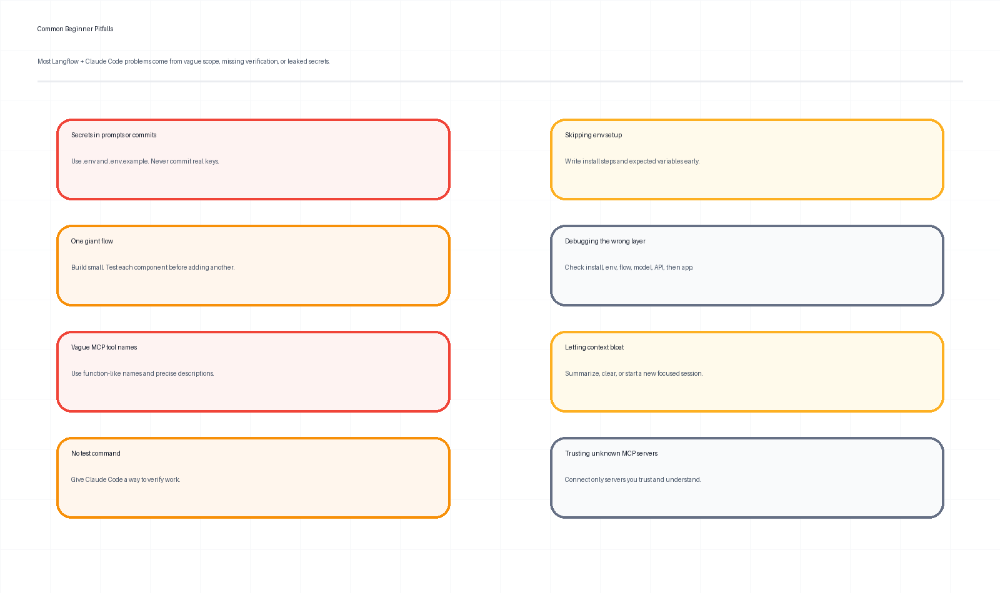

# A Beginner’s Step-by-Step Guide to Getting the Most from Langflow with Claude Code

**Author:** Manus AI  
**Date:** May 22, 2026  
**Audience:** Beginners who want a practical, low-friction way to build, test, document, automate, and extend Langflow projects with Claude Code.



## Executive summary

Langflow and Claude Code are strongest when they are used for different jobs. **Langflow is the visual lab and runtime for AI workflows.** It lets you connect components, test a flow in a Playground, serve flows through an API, and expose selected flows as tools through the Model Context Protocol, or MCP.[1] [3] [5] **Claude Code is the coding partner beside that lab.** It helps you understand a project folder, create scripts, edit files with approval, write tests, update documentation, use Git, and connect to external tools through MCP.[7] [8] [10]

The beginner mistake is to ask one tool to do the other tool’s job. Do not try to make Claude Code replace the Langflow canvas. Use Langflow for visual flow design. Use Claude Code for the repeatable engineering around that flow: installation notes, `.env.example`, API runners, flow export review, custom components, tests, README files, Git commits, and safe MCP setup.

> **Source grounding:** Langflow describes itself as an open-source, Python-based, customizable framework for building AI applications with a visual editor, flows, components, agents, MCP support, custom components, and API serving.[1] Claude Code’s documentation describes a coding assistant that runs in a project directory, reads files, proposes code changes, asks for approval, helps with Git, writes tests, refactors code, and supports common engineering workflows.[7] [8]

| Beginner question | Short answer |
| --- | --- |
| **What should I build first?** | Build a tiny Langflow flow: **Chat Input → Prompt → Claude model → Chat Output**. Test it before adding retrieval, tools, memory, custom components, or MCP. |
| **Where does Claude Code fit?** | Use it in your project folder to create scripts, docs, tests, `.env.example`, custom components, and Git commits. |
| **Should I start with MCP?** | No. MCP is powerful, but it should come after you have a tested flow, a clear tool name, a precise description, and safe boundaries.[5] [10] |
| **Should I paste API keys into Claude Code?** | No. Use environment variables and `.env.example`. Never commit real keys. Langflow API keys and Anthropic API keys are credentials and should be handled as secrets.[3] [6] |

---

## 1. Understand the mental model before installing anything

Langflow works like a **visual circuit board for AI applications**. Each component is a node. You connect nodes to pass data from one step to the next. A flow may start with a user message, shape that message through a prompt, send it to a model, and return a visible answer. Langflow’s visual editor is useful because a beginner can see the structure of the workflow instead of hiding it inside a Python file.[1]

Claude Code works like a **senior developer sitting inside your terminal**. It can inspect your files, explain your project, propose edits, make changes after approval, run commands, help with Git, write tests, and document what it changed.[7] [8] It is not the Langflow canvas. It is the assistant that keeps your Langflow work organized, reproducible, tested, and versioned.



| Role | Best use | Avoid using it for |
| --- | --- | --- |
| **Langflow** | Designing and testing flows visually, using built-in components, experimenting in Playground, serving flows through API or MCP. | Long-form project documentation, Git commits, bulk file editing, scripted testing, and project scaffolding. |
| **Claude Code** | Creating project files, API scripts, test harnesses, custom components, README updates, troubleshooting notes, Git workflows, and MCP configuration review. | Blindly changing flow logic without you testing it in Langflow. |
| **Git** | Versioning flow exports, scripts, documentation, and custom components. | Storing real credentials, local databases, logs, or generated secrets. |

A good workflow is simple: **build visually, automate carefully, verify often, and document as you go.**

---

## 2. Choose your Langflow installation path

Langflow provides several installation options, including Desktop, Docker, Python package installation, and installation from source.[2] For a beginner, the right choice depends on your comfort level and what you need to do next.

| Option | Best for | Command or action | Beginner hint | Things to avoid |
| --- | --- | --- | --- | --- |
| **Langflow Desktop** | Fastest start on a personal machine. | Download from the Langflow Desktop page. | Use this if you want simple dependency management and easy upgrades. | Some features are unavailable in Desktop, including Shareable Playground and Voice Mode according to the Langflow installation documentation.[2] |
| **Docker** | Clean local sandbox, easier reset, closer to deployment. | `docker run -p 7860:7860 langflowai/langflow:latest` | Good when you do not want Python dependency conflicts. | Do not forget volume mounts if you need persistent data or custom components. |
| **Python package** | More control over Python environment and custom dependencies. | `uv pip install langflow` then `uv run langflow run` | Use a fresh virtual environment. Langflow documents Python version requirements and recommends `uv`.[2] | Do not install into a messy global Python environment. |
| **Source install** | Contributing to Langflow or modifying Langflow itself. | Clone source and follow contributor steps. | Use only after you know why you need it. | Do not start here as a beginner. |

> **Practical recommendation:** Start with **Desktop** if you only want to learn flows. Start with **Docker** if you want a clean, repeatable setup. Start with the **Python package** if you know you will add Python dependencies or custom components soon.

### Quick Docker start

If Docker is installed and running, you can start Langflow with:

```bash
docker run -p 7860:7860 langflowai/langflow:latest
```

Then open:

```text
http://localhost:7860/
```

Langflow’s installation documentation also shows local access through `http://127.0.0.1:7860` for a local instance.[2]

### Python package start

If you prefer a Python environment, use `uv` and a virtual environment. The exact environment setup will vary by operating system, but a clean pattern is:

```bash
mkdir langflow-lab
cd langflow-lab
uv venv .venv
source .venv/bin/activate
uv pip install langflow
uv run langflow run
```

If you are on Windows, use the activation command appropriate for your shell. The important habit is not the exact shell syntax. The important habit is isolation. Keep Langflow away from unrelated Python packages.

---

## 3. Install Claude Code and start it in the right folder

Claude Code’s quickstart shows native installation commands for macOS, Linux, WSL, Windows PowerShell, Windows CMD, Homebrew, and WinGet.[7] On macOS, Linux, or WSL, the native install command is:

```bash
curl -fsSL https://claude.ai/install.sh | bash
```

After installation, start Claude Code in your project folder:

```bash
mkdir langflow-claude-lab
cd langflow-claude-lab
claude
```

Claude Code requires login on first use, and the quickstart notes that `/login` can be used to switch or authenticate accounts.[7]

| Command | What it is useful for | Beginner example |
| --- | --- | --- |
| `claude` | Start an interactive session in the current folder. | `claude` |
| `claude "task"` | Run a one-time task. | `claude "explain this project folder"` |
| `claude -p "query"` | Ask a one-off query and exit. | `claude -p "summarize README.md"` |
| `claude -c` | Continue the most recent conversation in the current directory. | `claude -c` |
| `/help` | Show available commands inside Claude Code. | `/help` |
| `/clear` | Clear the current conversation context. | `/clear` |

> **Tip:** Always launch Claude Code from the folder that contains your Langflow project files. Claude Code uses the current project directory as its working context.[7] If you launch it from your home directory, it may inspect or edit the wrong place.

---

## 4. Create a clean project folder before building serious flows

A beginner often builds a working flow and then loses track of the flow ID, environment variables, API keys, and test input. Avoid that by creating a small project structure first. Ask Claude Code to create it for you.

Use this prompt in Claude Code:

```text
Create a clean starter structure for a Langflow project. Include README.md, .env.example, scripts/, tests/, custom_components/, flows/, and notes/. Do not create or store real secrets. Add a short explanation of what each folder is for.
```

A practical folder structure looks like this:

```text
langflow-claude-lab/
├── README.md
├── CLAUDE.md
├── .env.example
├── flows/
│   └── README.md
├── scripts/
│   └── run_flow.py
├── tests/
│   └── README.md
├── custom_components/
│   └── README.md
└── notes/
    └── troubleshooting.md
```

| File or folder | Purpose |
| --- | --- |
| `README.md` | Human-friendly setup, run, and troubleshooting instructions. |
| `CLAUDE.md` | Persistent instructions Claude Code reads at the start of sessions. Claude Code best practices recommend keeping this concise and useful.[9] |
| `.env.example` | A safe template for environment variables without real secrets. |
| `flows/` | Exported Langflow flow JSON files and notes about flow IDs. |
| `scripts/` | Python, curl, or JavaScript scripts that call Langflow APIs. |
| `tests/` | Repeatable checks for API calls, expected outputs, and custom components. |
| `custom_components/` | Python components you add only when built-ins are not enough. |
| `notes/` | Debug logs, decisions, and lessons learned. |

### Create a beginner-friendly `CLAUDE.md`

Claude Code best practices recommend writing an effective `CLAUDE.md` with project-specific commands, style rules, workflow rules, and gotchas, while keeping it concise.[9] Use this as a starter:

```markdown
# CLAUDE.md

## Project purpose
This folder supports a Langflow learning project. Langflow is the visual flow builder. Claude Code helps maintain scripts, docs, tests, and custom components.

## Safety rules
- Never write, print, or commit real API keys.
- Use .env for local secrets and .env.example for templates.
- Do not commit local databases, logs, caches, or exported credentials.
- Ask before deleting files or rewriting large sections.

## Common commands
- Start Langflow with Docker: docker run -p 7860:7860 langflowai/langflow:latest
- Local Langflow URL: http://localhost:7860
- Run API script: python scripts/run_flow.py

## Workflow
- Explore before editing.
- Make small changes.
- Verify with a command, API call, or manual Playground test.
- Update README.md when setup steps change.
```

This file should be short. If you put a full tutorial inside `CLAUDE.md`, Claude Code may waste context on information it does not need every session. The best-practices documentation explicitly warns that bloated instructions can cause important rules to be ignored.[9]

---

## 5. Build your first Langflow flow the boring way

Beginners should begin with a boring flow. Boring is good. Boring is testable. Boring gives you a baseline before you add retrieval, agents, memory, tools, MCP, or custom components.



A starter flow should contain four pieces: **Chat Input**, **Prompt**, **Anthropic / Claude model**, and **Chat Output**. Langflow’s Anthropic bundle provides a component for Anthropic Chat and Language models such as Claude, and the component can output either a `Message` or a `LanguageModel` for use in other LLM-driven components.[6]

| Component | What it does | Beginner setting to check |
| --- | --- | --- |
| **Chat Input** | Receives the user’s message. | Confirm the input type matches chat. |
| **Prompt** | Adds instructions and variables. | Keep the prompt short and specific. |
| **Anthropic / Claude model** | Generates the model response. | Use an API key through a secret field or environment-backed setting; tune temperature carefully.[6] |
| **Chat Output** | Displays the result and makes the flow usable in expected chat patterns. | A Chat Output is also required when serving a Langflow flow as an MCP tool.[5] |

### A good first prompt

Use something narrow and easy to inspect:

```text
You are a concise assistant. Answer the user's question in plain English. If the question is unclear, ask one clarifying question.

User question: {input_value}
```

### Test it in Playground

Langflow includes a Playground for testing flows and getting real-time feedback without building a full application stack.[1] Use the Playground before you write any API script.

| Test input | Expected behavior |
| --- | --- |
| `What is Langflow in one sentence?` | Returns one concise sentence. |
| `Explain it like I am new to AI.` | Uses beginner-friendly language. |
| `It broke.` | Asks a clarifying question instead of guessing. |

> **Tip:** Test one component at a time when possible. If the whole flow fails, you want to know whether the problem is the model key, prompt variable, input type, output type, or external data source.

---

## 6. Use Claude Code to document the flow while it is fresh

After your first flow works, ask Claude Code to help you record what you built. This is not busywork. It prevents the common beginner problem where a flow works once, but nobody remembers how to run it later.

Use this prompt:

```text
I created a Langflow flow with Chat Input, Prompt, Anthropic/Claude model, and Chat Output. Help me update README.md with: purpose, required environment variables, how to run Langflow locally, how to test in Playground, and a checklist for exporting the flow JSON. Do not include real secrets.
```

Ask Claude Code to create a table like this:

| Field | Value to fill in |
| --- | --- |
| Flow name | `beginner_chat_flow` |
| Flow purpose | Short description of what the flow answers. |
| Local URL | `http://localhost:7860` |
| Flow ID | Paste from Langflow after saving. |
| Required keys | `ANTHROPIC_API_KEY`, `LANGFLOW_API_KEY` if needed. |
| Test input | A question that should produce a known style of answer. |
| Expected output | Describe what “good” looks like. |

Claude Code is good at turning your rough notes into repeatable documentation. It is also good at keeping documentation aligned with scripts and tests, as long as you ask it to verify the files it changes.[8] [9]

---

## 7. Run the flow through the Langflow API

Langflow’s API documentation explains that the API can be used for programmatic interactions such as creating and editing flows, developing applications that use flows, developing custom components, and building Langflow into larger applications.[3] For application development, the most common endpoints include flow trigger endpoints such as `POST /v1/run/{flow_id_or_name}`, `POST /v1/run/advanced/{flow_id}`, and `POST /v1/webhook/{flow_id_or_name}`.[3]



Langflow’s API examples show the common pattern: set a base URL, set a flow ID, set a Langflow API key, and send a request to the run endpoint.[3] A beginner-safe `.env.example` should look like this:

```bash
# .env.example
LANGFLOW_SERVER_URL=http://localhost:7860
LANGFLOW_API_KEY=replace_with_your_langflow_api_key
FLOW_ID=replace_with_your_flow_id
```

Do not put real values into `.env.example`. Put real values in a local `.env` file that is ignored by Git.

### Ask Claude Code to create the API runner

Use this prompt:

```text
Create scripts/run_flow.py that loads LANGFLOW_SERVER_URL, LANGFLOW_API_KEY, and FLOW_ID from environment variables. It should POST a test message to /api/v1/run/{FLOW_ID}?stream=false, print the raw JSON response, handle missing variables clearly, and never hardcode secrets. Also create .gitignore entries for .env and local caches.
```

A simple runner can look like this:

```python
# scripts/run_flow.py
import os
import sys
import requests

server_url = os.getenv("LANGFLOW_SERVER_URL", "http://localhost:7860")
api_key = os.getenv("LANGFLOW_API_KEY")
flow_id = os.getenv("FLOW_ID")

if not api_key or not flow_id:
    sys.exit("Missing LANGFLOW_API_KEY or FLOW_ID. Check your local .env file.")

url = f"{server_url}/api/v1/run/{flow_id}?stream=false"
headers = {
    "Content-Type": "application/json",
    "x-api-key": api_key,
}
payload = {
    "input_value": "Explain Langflow in one sentence.",
    "output_type": "chat",
    "input_type": "chat",
}

response = requests.post(url, headers=headers, json=payload, timeout=60)
response.raise_for_status()
print(response.text)
```

Langflow’s examples use the same broad request shape: a URL based on the server and flow ID, an `x-api-key` header, and payload fields such as `input_value`, `output_type`, and `input_type`.[3]

| If this fails | Check this first |
| --- | --- |
| Connection refused | Is Langflow running? Is the URL `http://localhost:7860` correct? |
| 401 or 403 | Is the API key correct? Did you put it in the right header? |
| 404 | Is the flow ID correct? Did you save the flow? |
| 422 | Does your payload match the expected input and output types? |
| Slow or timeout | Is the model call working in Playground? Is the external model provider available? |

---

## 8. Use the Claude Code loop: explore, plan, implement, verify, commit

Claude Code’s best-practices documentation recommends giving Claude a way to verify its work and using an explore-plan-code-commit style workflow for larger changes.[9] This matters because Langflow projects have several layers: local environment, flow canvas, API, model provider, custom code, and possibly MCP. If Claude Code edits too soon, it may solve the wrong problem.



| Phase | What to ask Claude Code | Good beginner prompt |
| --- | --- | --- |
| **Explore** | Understand the current files before changing them. | `Review this folder and explain how the Langflow project is organized. Do not edit files yet.` |
| **Plan** | Propose specific changes. | `Create a plan to add a script that runs my flow through the API. Include files to change and verification steps.` |
| **Implement** | Make the smallest useful change. | `Implement the plan. Do not hardcode secrets. Update .env.example if needed.` |
| **Verify** | Run a check or define a manual check. | `Run the script if possible. If not, tell me the exact command I should run and what output to expect.` |
| **Commit** | Save the work with clear context. | `Show changed files, summarize risks, and create a descriptive Git commit.` |

> **Tip:** When you are unsure, ask Claude Code to interview you. A strong prompt is: `Ask me up to five questions before you change files. Focus on flow ID, local URL, authentication, expected input, and expected output.`

---

## 9. Version your flow exports without leaking secrets

Langflow flows can be exported and stored with your project. That is useful because it gives you a backup, lets you compare changes over time, and helps Claude Code inspect the structure. However, exported files can include configuration details. Treat them carefully.

Ask Claude Code:

```text
Review the exported flow JSON in flows/. Identify component names, inputs, outputs, and possible hardcoded secrets. Do not print secret values. Suggest safer names and documentation improvements.
```

| Good practice | Why it matters |
| --- | --- |
| Use clear flow names. | Flow names later become important when humans and agents decide what a flow does. |
| Use environment variables for secrets. | Secrets should not live in exported JSON, docs, prompts, or commits. |
| Commit flow exports after meaningful changes. | You can revert if a visual experiment breaks the flow. |
| Add a changelog entry. | Future you will know why the flow changed. |
| Ask Claude Code to summarize diffs. | Flow JSON can be noisy; Claude Code can translate it into human language. |

A useful commit message format is:

```text
Add beginner chat flow and API runner

- Adds exported Langflow flow JSON
- Adds scripts/run_flow.py for local API testing
- Adds .env.example and setup notes
- Documents Playground test cases
```

---

## 10. Add retrieval, tools, or agents only after the basic flow works

Once the basic flow works through Playground and the API, you can add more capability. Do it in layers. Do not add everything at once.

| Next layer | What it adds | Beginner test |
| --- | --- | --- |
| **Files or document input** | Lets the flow answer from uploaded or provided text. | Ask one question whose answer is clearly in the file. |
| **Vector database or retriever** | Adds retrieval-augmented generation. | Ask a question that should cite or use retrieved context. |
| **Tool component** | Lets the flow call an external function or service. | Use a harmless read-only tool first. |
| **Agent** | Lets the model choose among tools or steps. | Give it a narrow task with a visible success condition. |
| **Memory** | Lets conversations retain state. | Test whether it remembers only what it should remember. |

Use Claude Code as your test designer here. Ask:

```text
Create a small test plan for this Langflow change. Include three happy-path tests, three edge cases, and one security or privacy risk. Do not edit files yet.
```

Claude Code’s best-practices documentation emphasizes verification: tests, screenshots, expected outputs, or commands that let Claude check its own work.[9] That principle applies directly to Langflow. Every new component should come with a way to know whether it works.

---

## 11. Create a custom Langflow component when built-ins are not enough

Custom components are one of the biggest ways Claude Code can help. Langflow custom components are Python classes that inherit from `Component`; they use class-level attributes, input and output lists, and methods that define behavior.[4] Claude Code can write the boilerplate, explain it, and help test it.



Langflow’s custom component documentation states that custom components need the correct folder structure, including category folders and `__init__.py` files, and Docker deployments can mount a custom component directory with `LANGFLOW_COMPONENTS_PATH`.[4]

| Part | What it means |
| --- | --- |
| `custom_components/data/` | A category folder. The category affects where the component appears. |
| `__init__.py` | Makes the folder importable and exposes the component class. |
| `my_component.py` | The component implementation. |
| `display_name` | Human-friendly name in the visual editor. |
| `description` | What the component does. Keep it precise. |
| `inputs` | Fields or connected data the component receives. |
| `outputs` | Output ports and the method Langflow should call. |

### Prompt Claude Code for a custom component safely

Use a narrow prompt:

```text
Create a Langflow custom component in custom_components/data/clean_text_component.py. It should accept text, strip extra whitespace, optionally lowercase it, and return cleaned text. Include __init__.py. Keep the component small. Do not add external dependencies. Add a short README explaining how to mount this folder with LANGFLOW_COMPONENTS_PATH in Docker.
```

Avoid broad prompts like:

```text
Make me a custom component that handles all my data processing.
```

That prompt is too vague. It encourages one large component that is hard to test. Instead, create small components that do one job.

### Docker mount pattern for custom components

Langflow’s custom component documentation shows the pattern of mounting a local custom components directory and setting `LANGFLOW_COMPONENTS_PATH` in Docker.[4]

```bash
docker run -d \
  --name langflow \
  -p 7860:7860 \
  -v ./custom_components:/app/custom_components \
  -e LANGFLOW_COMPONENTS_PATH=/app/custom_components \
  langflowai/langflow:latest
```

> **Tip:** After adding a custom component, restart Langflow, refresh the browser, and look for the component under the expected category. If it does not appear, check the folder name, `__init__.py`, class import, and Python errors.

---

## 12. Use MCP only when the flow is safe and well named

MCP lets tools and data sources connect to AI systems through a common protocol. Langflow can act as both an MCP server and MCP client.[5] Claude Code can also connect to tools and data sources through MCP servers.[10] This is powerful because a Langflow flow can become a tool that Claude Code or another MCP client can call.



Langflow’s MCP server documentation explains that a project can expose flows as MCP tools, that a flow needs a **Chat Output** component to be used as an MCP tool, and that tool names and descriptions matter because MCP clients use them to decide which tool to call.[5]

| MCP readiness check | Pass condition |
| --- | --- |
| Flow has Chat Output | Required for Langflow MCP tool exposure.[5] |
| Flow has been tested in Playground | You know the flow works before another agent calls it. |
| Flow has been tested through API | You know runtime inputs and outputs behave as expected. |
| Tool name is clear | Use a function-like name such as `summarize_support_ticket`, not a UUID. |
| Tool description is precise | State what the tool does and what it does not do. |
| Tool is safe | It should not leak secrets, delete data, send messages, or spend money without guardrails. |

### Example MCP naming

| Weak name | Stronger name | Why it is stronger |
| --- | --- | --- |
| `flow_123` | `summarize_pdf_for_beginner` | Describes the action and audience. |
| `qa_tool` | `answer_questions_from_company_handbook` | Names the source of truth. |
| `agent` | `draft_support_reply_no_send` | Clarifies that it drafts but does not send. |

Claude Code’s MCP documentation warns that you should verify that you trust each MCP server before connecting it, especially because servers that fetch external content can create prompt injection risk.[10] Treat this warning seriously. MCP can give an agent access to real systems. Start with read-only tools and narrow scopes.

---

## 13. Build your personal prompt library

Beginners get better results when they reuse strong prompts. Claude Code can work from natural language, but precise prompts reduce mistakes. Save these in `notes/prompt_library.md`.

| Situation | Prompt |
| --- | --- |
| Understand the folder | `Give me a high-level overview of this Langflow project folder. Explain the purpose of each top-level file and folder. Do not edit anything.` |
| Create a plan | `Plan how to add [feature]. Identify files to change, Langflow steps I must do manually, risks, and verification steps. Do not edit yet.` |
| Write API script | `Create a script that calls my Langflow flow through /api/v1/run/{FLOW_ID}. Use env vars. Do not hardcode secrets. Print useful errors.` |
| Review flow export | `Review flows/[file].json. Summarize components, data flow, possible hardcoded secrets, and naming improvements. Do not print secret values.` |
| Debug failure | `Help debug this Langflow issue. First classify whether it is install, environment, flow design, model provider, API, or application code. Ask for missing details before editing.` |
| Create tests | `Create a test plan with happy paths, edge cases, and failure cases for this flow. Include exact inputs and expected outputs.` |
| Improve docs | `Update README.md so a beginner can run this project from scratch. Include prerequisites, commands, env vars, test steps, and troubleshooting.` |
| Create custom component | `Create a small Langflow custom component that does exactly [task]. Include __init__.py, no unnecessary dependencies, and a short usage note.` |
| Prepare MCP | `Evaluate whether this flow is safe to expose as an MCP tool. Suggest a tool name, description, allowed inputs, and risks.` |

> **Trick:** Ask Claude Code to state assumptions before implementation. A useful phrase is: `List your assumptions. If any assumption is risky, ask me before proceeding.`

---

## 14. Debug with layers, not guesses

When a Langflow project fails, beginners often jump to the last thing they changed. That can waste time. Debug by layer.



Use this ladder:

| Layer | What to check | Example evidence |
| --- | --- | --- |
| **Installation** | Is Langflow running? Is the browser at the right URL? | `http://localhost:7860` loads. |
| **Environment** | Are API keys and flow IDs present? | `.env` contains local values; `.env.example` has placeholders. |
| **Flow design** | Do components connect correctly? | Playground succeeds with a simple input. |
| **Model provider** | Does the model key and model name work? | The Anthropic component returns a response in Playground.[6] |
| **API request** | Does the request path, header, and payload match the endpoint? | `POST /api/v1/run/{FLOW_ID}` returns JSON.[3] |
| **Application code** | Does your script parse and display the response correctly? | The raw JSON looks right, but your app formatting is wrong. |
| **MCP** | Is the tool exposed, named well, authenticated, and visible to the client? | `/mcp` or client status shows the tool, and the tool description is clear.[5] [10] |

Ask Claude Code to debug in this order:

```text
Debug this issue by layer: installation, environment, flow design, model provider, API request, application code, and MCP. Do not change files until you identify the most likely layer. Ask me for any missing logs or screenshots.
```

This prompt prevents random fixes. It forces Claude Code to locate the failing layer first.

---

## 15. A seven-day beginner practice plan

You do not need to learn everything in one sitting. A week of focused practice is enough to become productive.

| Day | Goal | Deliverable |
| --- | --- | --- |
| **Day 1** | Install Langflow and Claude Code. | A project folder with `README.md`, `.env.example`, and `CLAUDE.md`. |
| **Day 2** | Build the first basic flow. | A working Chat Input → Prompt → Claude → Chat Output flow. |
| **Day 3** | Test and document. | Playground test cases and a flow notes table. |
| **Day 4** | Use the API. | `scripts/run_flow.py` successfully calls the flow. |
| **Day 5** | Version the project. | Flow export committed with docs and no secrets. |
| **Day 6** | Extend carefully. | One retrieval layer or one small custom component. |
| **Day 7** | Prepare for reuse. | Troubleshooting guide, prompt library, and optional MCP readiness review. |

By the end of the week, you should understand the whole lifecycle: build, test, run, document, version, extend, and safely expose.

---

## 16. Golden rules and things to avoid

| Do | Avoid |
| --- | --- |
| Start with the smallest useful flow. | Building a giant agentic system before a simple chat flow works. |
| Store secrets in local environment variables. | Pasting real API keys into prompts, README files, flow exports, or Git commits. |
| Give Claude Code verification criteria. | Asking Claude Code to “make it better” without tests or expected outputs. |
| Use clear names for flows and MCP tools. | Leaving tool names as UUIDs or vague labels. |
| Export and version flow JSON carefully. | Assuming the Langflow UI is the only source of truth. |
| Keep `CLAUDE.md` short and specific. | Turning `CLAUDE.md` into a long tutorial. |
| Add one capability at a time. | Adding retrieval, memory, agents, tools, and MCP all at once. |
| Use read-only tools first. | Giving agents broad write, delete, payment, email, or production access too early. |

The best trick is also the simplest: **write down the expected output before you ask Claude Code to build or fix anything.** Claude Code works better when it can verify its own work.[9]

---

## 17. Copy-paste starter checklist

Use this checklist whenever you start a new Langflow project.

```markdown
# Langflow + Claude Code Starter Checklist

## Setup
- [ ] Langflow runs locally.
- [ ] Claude Code opens in the project folder.
- [ ] README.md exists.
- [ ] CLAUDE.md exists and is short.
- [ ] .env.example exists with placeholders only.
- [ ] .env is ignored by Git.

## First flow
- [ ] Flow has Chat Input.
- [ ] Flow has Prompt.
- [ ] Flow has Anthropic/Claude model or another selected LLM.
- [ ] Flow has Chat Output.
- [ ] Playground test succeeds.
- [ ] Flow purpose is documented.

## API
- [ ] FLOW_ID is recorded outside source code.
- [ ] LANGFLOW_SERVER_URL is documented.
- [ ] LANGFLOW_API_KEY is stored only in local environment.
- [ ] scripts/run_flow.py or equivalent works.
- [ ] Errors are handled clearly.

## Versioning
- [ ] Flow export is saved in flows/.
- [ ] Claude Code reviewed export for possible secrets.
- [ ] README has run instructions.
- [ ] Changes are committed.

## Extension
- [ ] Added only one new capability at a time.
- [ ] New component or retrieval layer has tests.
- [ ] Custom components are small and documented.

## MCP readiness
- [ ] Flow has Chat Output.
- [ ] Flow is safe to expose.
- [ ] Tool name is clear.
- [ ] Tool description is precise.
- [ ] Authentication is understood.
- [ ] Client connection is verified.
```

---

## 18. Final recommended workflow

If you remember only one thing, remember this sequence:

1. Build a small flow visually in Langflow.
2. Test it manually in Playground.
3. Ask Claude Code to document it.
4. Ask Claude Code to create a safe API runner.
5. Verify the runner.
6. Export and version the flow.
7. Add one capability at a time.
8. Use custom components only when built-ins are not enough.
9. Use MCP only after the tool is safe, named, described, and tested.

That workflow keeps you fast without becoming reckless. It gives you the joy of visual AI building and the discipline of software engineering.

---

## References

[1]: https://docs.langflow.org/ "Langflow Documentation: What is Langflow?"  
[2]: https://docs.langflow.org/get-started-installation "Langflow Documentation: Install Langflow"  
[3]: https://docs.langflow.org/api-reference-api-examples "Langflow Documentation: Get started with the Langflow API"  
[4]: https://docs.langflow.org/components-custom-components "Langflow Documentation: Create custom Python components"  
[5]: https://docs.langflow.org/mcp-server "Langflow Documentation: Use Langflow as an MCP server"  
[6]: https://docs.langflow.org/bundles-anthropic "Langflow Documentation: Anthropic bundle"  
[7]: https://code.claude.com/docs/en/quickstart "Claude Code Docs: Quickstart"  
[8]: https://code.claude.com/docs/en/common-workflows "Claude Code Docs: Common workflows"  
[9]: https://code.claude.com/docs/en/best-practices "Claude Code Docs: Best practices for Claude Code"  
[10]: https://code.claude.com/docs/en/mcp "Claude Code Docs: Connect Claude Code to tools via MCP"
